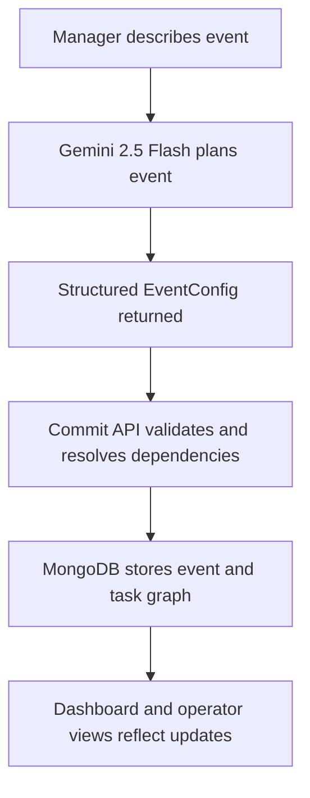

# ELIXA
## Event Orchestration Platform

> Describe your event. Watch it come alive.

HackByte 4.0 | PDPM IIITDM Jabalpur | MLH Official 2026 Season

## Tech Stack


## Overview

Elixa is an AI-powered event orchestration platform that converts unstructured organizer discussions into a clear execution pipeline with tasks, owners, dependencies, and checkpoints.

It is built for hackathons and college events where teams must coordinate permissions, venue logistics, sponsors, registrations, volunteer management, and final Go/No-Go readiness.

## Problem We Solve

Before any major event, teams usually juggle 30-60 critical tasks in chats and calls. This often creates:

- unclear ownership
- hidden dependencies
- delayed approvals and blockers

Elixa solves this with a checklist-to-checkpoint model where each phase has assigned owners and visible progress.

## Checklist-to-Checkpoint Pipeline

| Phase | Owner | Core Responsibility |
|---|---|---|
| Permissions | Director | institute approvals, date clearances |
| Venue | Venue Lead | hall booking, AV, layout readiness |
| Sponsors | Sponsor Lead | outreach, follow-ups, commitment tracking |
| Registrations | Tech Lead | registration setup and technical readiness |
| Volunteers | Volunteer Coordinator | role assignment, shifts, execution support |
| Go/No-Go | Director | final cross-team readiness gate |

## Product Screens

<table>
  <tr>
    <td valign="top" width="50%">
      <h4>Before Login</h4>
      
    </td>
    <td valign="top" width="50%">
      <h4>After Login</h4>
      
    </td>
  </tr>
</table>

<table>
  <tr>
    <td valign="top" width="50%">
      <h4>Event Orchestration Entry</h4>
      
    </td>
    <td valign="top" width="50%">
      <h4>Event Setup</h4>
      
    </td>
  </tr>
</table>

<table>
  <tr>
    <td valign="top" width="50%">
      <h4>Plan Generation</h4>
      
    </td>
    <td valign="top" width="50%">
      <h4>Conversation Planner</h4>
      
    </td>
  </tr>
</table>


## System Architecture

### Frontend

- Next.js 14 App Router with TypeScript
- Tailwind CSS v3 with shadcn/ui components
- Animated interface patterns using Framer Motion
- Event orchestration pages under `src/app/event-orchestration/`

### API Layer

Core orchestration APIs are under `src/app/api/orchestration/`:

- `plan` for AI planning flow
- `commit` for saving structured event plans
- `auth` for operator code login
- `action` for task status and operator actions
- `checkpoint` for phase gate controls
- `events` and `event/[id]` for event queries

Additional orchestration utilities exist for announcements, summary, and tasks management.

### AI + Data Layer

- Gemini 2.5 Flash powers planning and structured generation
- MongoDB Atlas persists events, operators, checkpoints, and task history
- Dependency references are resolved before persistent writes

### Sync and Session Model

- optimistic UI updates for responsive task operations
- MongoDB-backed state refresh through periodic polling
- localStorage-backed operator session context

## Request Flow



Critical separation:

- `POST /api/orchestration/plan` handles AI planning only
- `POST /api/orchestration/commit` handles persistence only

## Role-Based Access

- Director: full control and checkpoint authority
- Phase Leads: scoped actions for their owned phase
- Volunteers: assigned-task execution and blocker reporting

## Secondary Module: Live Event Management

`/game-planning` provides command-driven event execution support with:

- scoreboard and team status operations
- speech-driven command interpretation
- AI-assisted fallback behavior for command processing

## Environment Variables

```bash
# AI
GOOGLE_GENERATIVE_AI_API_KEY=
GROQ_API_KEY=
ELEVENLABS_API_KEY=

# Database
MONGODB_URI=

# Firebase Auth
NEXT_PUBLIC_FIREBASE_API_KEY=
NEXT_PUBLIC_FIREBASE_AUTH_DOMAIN=
NEXT_PUBLIC_FIREBASE_PROJECT_ID=
NEXT_PUBLIC_FIREBASE_APP_ID=
```

## Implementation Status

Implemented and aligned with this codebase:

- AI-assisted event orchestration workflow
- role-based operator access and scoped task actions
- checkpoint-aware progression model
- MongoDB persistence with historical state transitions
- game-planning support for live operations

Current constraints documented in implementation:

- polling-based sync model instead of sub-second realtime transport
- localStorage-backed session mechanism

## Built For

HackByte 4.0 | PDPM IIITDM Jabalpur
